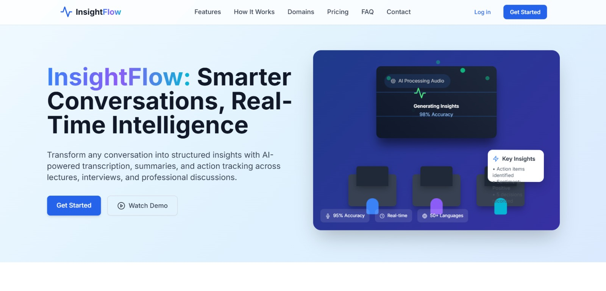
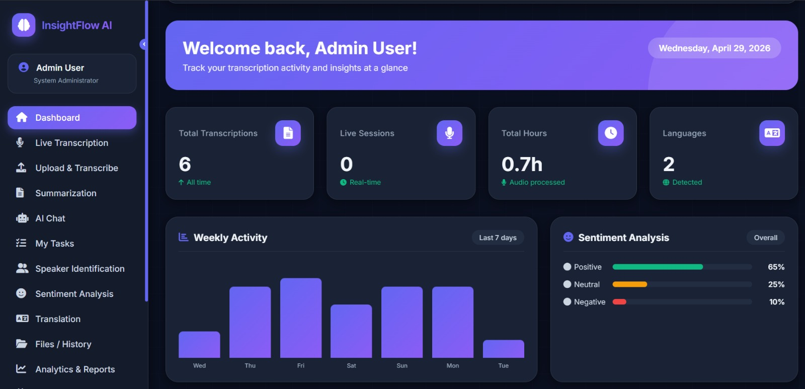
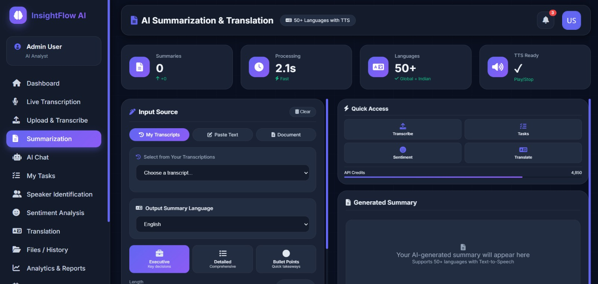
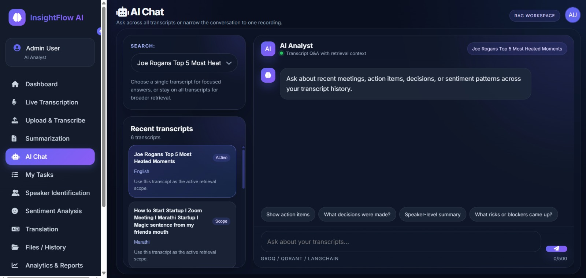
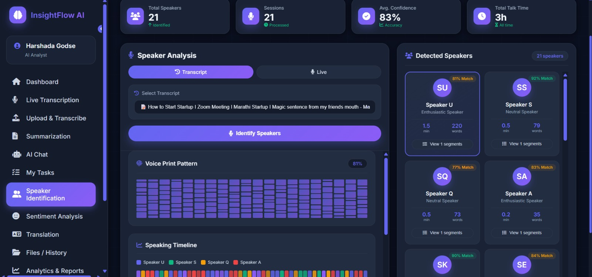
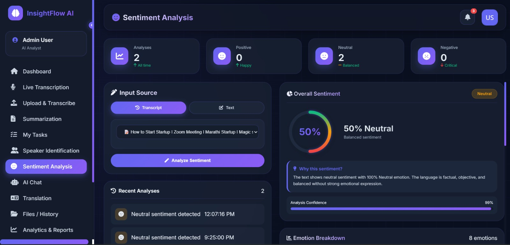
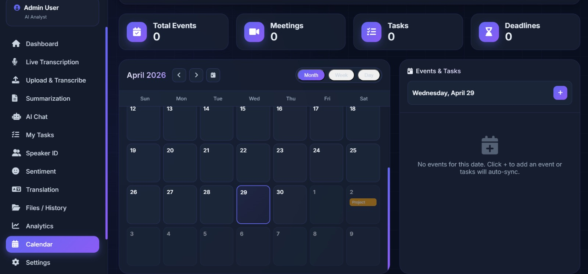

# InsightFlow AI

InsightFlow AI is a Flask-based dashboard for transcription, summarization, action-item extraction, sentiment analysis, translation, and transcript-aware AI chat.


## UI Preview

### Marketing Landing Page


### Dashboard


### Upload & Transcribe


### AI Summarization & Translation


### AI Chat


### Speaker Identification


### Sentiment Analysis


### Calendar & Tasks



## Core stack

- Flask
- SQLAlchemy + Flask-Migrate
- AssemblyAI / Groq
- Qdrant for transcript retrieval
- HTML / CSS / JavaScript dashboard templates

## Main app areas

- `app.py` - routes and app wiring
- `models.py` - database models
- `config.py` - environment-driven configuration
- `modules/` - transcription, summarization, sentiment, translation, YouTube, and live transcription logic
- `services/` - RAG chat and Qdrant indexing/search
- `templates/` - dashboard and module pages
- `static/` - shared frontend assets

## Environment

Create a `.env` with the API keys and runtime settings the app needs, including:

- `SECRET_KEY`
- `ASSEMBLYAI_API_KEY`
- `GROQ_API_KEY`
- `QDRANT_URL`
- `QDRANT_API_KEY`
- `QDRANT_COLLECTION`

## Run locally

```bash
python -m venv .venv
.venv\Scripts\activate
pip install -r requirements.txt
python app.py
```

## Notes

- The AI Chat page is available at `/ai-chat`.
- Transcript indexing into Qdrant uses the `services/rag_index_service.py` pipeline.
- Existing transcripts can be reindexed through `POST /api/chat/reindex`.
